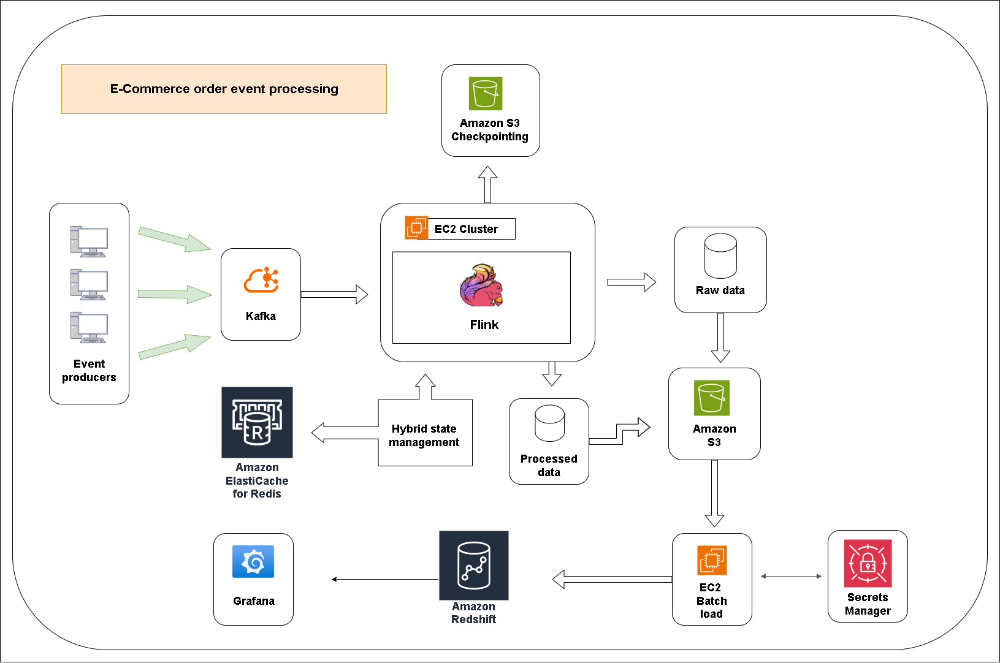

# Ecom Orders Streaming Pipeline

## Overview

**Ecom Orders** is a fault-tolerant streaming data pipeline designed to process **e-commerce order lifecycle events** in real time while handling common issues in distributed event systems such as:

* Out-of-order events
* Duplicate events
* Invalid lifecycle transitions
* Long-delayed events for the same order

The system processes events using **Apache Kafka**, **Apache Flink (PyFlink)**, **Amazon S3**, **Amazon Redshift**, and **Redis**.

The architecture is designed to support **exactly-once processing, fault tolerance, and scalable analytics workloads**.

---




---

# Running the System

### Start Kafka

```
bash/run_kafka_server.sh
```

### Start Flink Cluster

```
bash/start_flink_cluster.sh
bash/run_flink_cluster.sh
```

### Start Event Simulator

```
python data/run_sim.py
```

### Run Batch Loader

```
python flink/batch_load.py
```

# Data Model

SQL definitions are located in:

```
sql/create
sql/load
```

Main tables:

| Table                  | Purpose                                  |
| ---------------------- | ---------------------------------------- |
| `order_events`         | Valid processed events                   |
| `invalid_order_events` | Invalid lifecycle events                 |
| `order_events_staging` | Temporary Redshift load table            |
| `orders`               | Latest order state per order             |
| `s3_load_tracker`      | Partition-level load idempotency tracker |

---

---

# Example Event

```json
{
  "event_id": "a1c5c3f2-4a91-4d9a-bb5d-7c1b2a5d9c5e",
  "order_id": "ORD12345",
  "event_type": "ORDER_PAID",
  "timestamp": "2025-11-22T10:15:32Z",
  "payload": {
    "customer_id": "C123",
    "product_id": "P998",
    "quantity": 2,
    "price": 49.99
  }
}
```


# Key Features

### Robust Event Processing

The pipeline handles real-world streaming problems:

* Out-of-order events
* Duplicate events
* Invalid lifecycle transitions
* Late events arriving days after previous events

### Fault Tolerance

The system is resilient to failures including:

* Flink task manager crashes
* Sink outages (e.g., Redshift temporarily unavailable)
* Sudden traffic spikes

### Exactly-Once Data Guarantees

Exactly-once semantics are achieved through:

* **Flink checkpointing**
* **Durable S3 storage**
* **Partition tracking during Redshift batch loads**

This ensures events are **never lost or duplicated downstream**.

### Durable Event Storage

All events are written to S3 before being loaded into Redshift:

* Raw events
* Valid lifecycle events
* Invalid lifecycle events

This enables full **replayability and debugging**.

---

# Streaming Layer (PyFlink)

Implementation:

```
flink/RT_process.py
```

Responsibilities:

* Reads JSON events from Kafka topic **`order_events`**
* Keys stream by **`order_id`**
* Validates lifecycle progression
* Deduplicates events using **event_id  **
* Routes invalid transitions to a **side output**

Outputs written to S3:

| Output                    | Purpose                  |
| ------------------------- | ------------------------ |
| `raw/unloaded`            | Raw event archive        |
| `valid-events/unloaded`   | Valid lifecycle events   |
| `invalid-events/unloaded` | Invalid lifecycle events |

Flink **checkpointing** ensures recovery from failures.

---

# Handling Late Events Beyond Flink State TTL

Flink keyed state handles short-term lifecycle validation and deduplication.

However, order events may arrive **days after the previous event**, which can exceed Flink state TTL.

To maintain lifecycle continuity:

* **Redis stores long-term order state**
* If Flink state has expired:

  * Redis is queried for the previous lifecycle state
  * Validation continues correctly

This hybrid design allows the pipeline to support **long-delayed events without excessive Flink state growth**.

---

# Batch Load Layer (S3 → Redshift)

Implementation:

```
flink/batch_load.py
```

Batch loading steps:

1. Scan **S3 unloaded partitions**
2. Skip incomplete partitions
3. Load partitions into **Redshift staging tables**
4. Insert into final tables
5. Update the **orders aggregate table**
6. Track processed partitions in `s3_load_tracker`
7. Move files from `unloaded` → `loaded`

This design ensures **idempotent loads** and avoids duplicate ingestion.

---


# Order Lifecycle

Defined in:

```
data/events.py
```

Supported states:

```
ORDER_PENDING
ORDER_PAID
ORDER_SHIPPED
ORDER_DELIVERED
ORDER_CANCELLED
ORDER_PAID_CANCELLED
ORDER_RETURNED
ORDER_REFUNDED
```

The system validates that transitions follow a **valid forward lifecycle progression**.

Backward transitions are routed to the **invalid event stream**.

---


---

# Configuration

Shared configuration is located in:

```
config.py
```

Includes:

* S3 bucket and prefixes
* Redshift connection configuration
* SQL file locations
* Table names

---

# Engineering Challenges & Solutions

### Out-of-Order Events

Distributed event systems rarely guarantee ordering.

For example:

```
ORDER_SHIPPED
ORDER_PAID
```

may arrive in reverse order.

**Solution**

* Stream is keyed by `order_id`
* Previous lifecycle state is stored in Flink keyed state
* Incoming events are validated against this state
* Invalid backward transitions are routed to the **invalid-event stream**

---

### Duplicate Events

Kafka producers or retries may produce duplicate messages.

**Solution**

Events contain a unique **`event_id`**.

Deduplication is performed using Flink keyed state:

* Processed event IDs are tracked
* Duplicate events are ignored

---

### Long-Delayed Events

Orders may receive updates **days after earlier events**.

Keeping Flink state indefinitely is not feasible.

**Solution**

A hybrid state strategy:

* Flink keyed state for recent events
* Redis for long-term order lifecycle storage

When Flink state expires, Redis provides the previous order state.

---

### Sink Failures

If Redshift becomes temporarily unavailable, streaming ingestion must continue.

**Solution**

Events are written to **S3 durable storage first**.

Redshift ingestion occurs asynchronously via batch jobs.

This decouples streaming ingestion from the analytics warehouse.

---

### Exactly-Once Processing

Failures during processing could cause duplicate loads.

**Solution**

Exactly-once guarantees rely on:

* Flink checkpointing
* Durable S3 storage
* Partition-level tracking in `s3_load_tracker`

Each S3 partition is loaded into Redshift **only once**.

---

# Technology Choices

### Apache Kafka

Kafka provides:

* High throughput event streaming
* Partition-based scalability
* Durable message storage
* Consumer replay capability

This makes it ideal for event-driven systems.

---

### Apache Flink

Flink provides:

* Stateful stream processing
* Exactly-once guarantees
* Low-latency event processing
* Side outputs for routing invalid events

Its **keyed state model** is ideal for lifecycle validation.

---

### Amazon S3

S3 serves as the **durable storage layer**.

Benefits:

* High durability
* Cost-efficient storage
* Decouples ingestion from analytics
* Supports full historical replay

---

### Amazon Redshift

Redshift provides:

* Columnar storage optimized for analytics
* High-performance SQL queries
* Efficient S3 ingestion via `COPY`
* Scalable data warehousing

---

### Redis

Redis acts as **external state storage** for long-delayed events.

Advantages:

* Low latency lookups
* Simple key-value model
* Supports lifecycle validation after Flink state expiration

---

# Scaling Considerations

The system is designed to scale horizontally across each layer.

### Kafka Scaling

Kafka scales via **topic partitioning**.

* Events are partitioned by `order_id`
* Multiple consumers process partitions in parallel
* Adding partitions increases parallel processing capacity

This allows ingestion of **millions of events per second**.

---

### Flink Scaling

Flink jobs scale through **parallel operators**.

The stream is keyed by `order_id`, enabling:

* parallel lifecycle validation
* distributed state storage
* load-balanced processing across task managers

Increasing **task manager instances** increases throughput.

---

### State Management

State growth is controlled through:

* **State TTL in Flink**
* **External Redis storage for long-term state**

This prevents excessive memory usage while preserving lifecycle history.

---

### S3 Throughput

S3 can handle extremely high write throughput.

Files are partitioned by:

```
date/hour
```

This improves parallel batch loading and query performance.

---

### Redshift Load Optimization

Batch ingestion is optimized through:

* S3 partition-based loading
* Redshift `COPY` commands
* Staging tables for efficient inserts
* Merge operations for maintaining the `orders` table

---

### Burst Traffic Handling

Traffic spikes are absorbed through:

* Kafka buffering
* Flink checkpoint-based recovery
* S3 durable event storage

This ensures the system remains stable during **cold bursts or flash sales**.


---

# Example Queries

### Latest Order State

```sql
SELECT *
FROM orders
WHERE order_id = 'ORD12345';
```

### Average Delivery Time

```sql
SELECT
    AVG(delivered_at - paid_at) AS avg_delivery_time
FROM orders
WHERE delivered_at IS NOT NULL;
```

### Invalid Lifecycle Events

```sql
SELECT *
FROM invalid_order_events
ORDER BY timestamp DESC;
```

---

# Design Goals

The system was built with the following goals:

* **Resilience** — tolerate infrastructure failures
* **Scalability** — support high event throughput
* **Data correctness** — exactly-once guarantees
* **Observability** — invalid event tracking and raw event storage
* **Extensibility** — easy addition of lifecycle states and analytics

---

# Future Improvements

Possible extensions:

* Kafka **Schema Registry integration**
* Flink **event-time watermarking**
* Real-time **metrics dashboards**
* Streaming **order aggregates**
* Monitoring with **Prometheus and Grafana**

---
